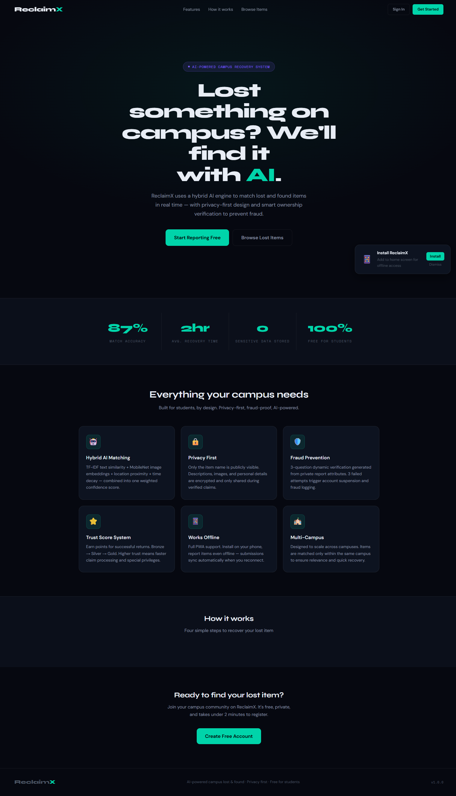
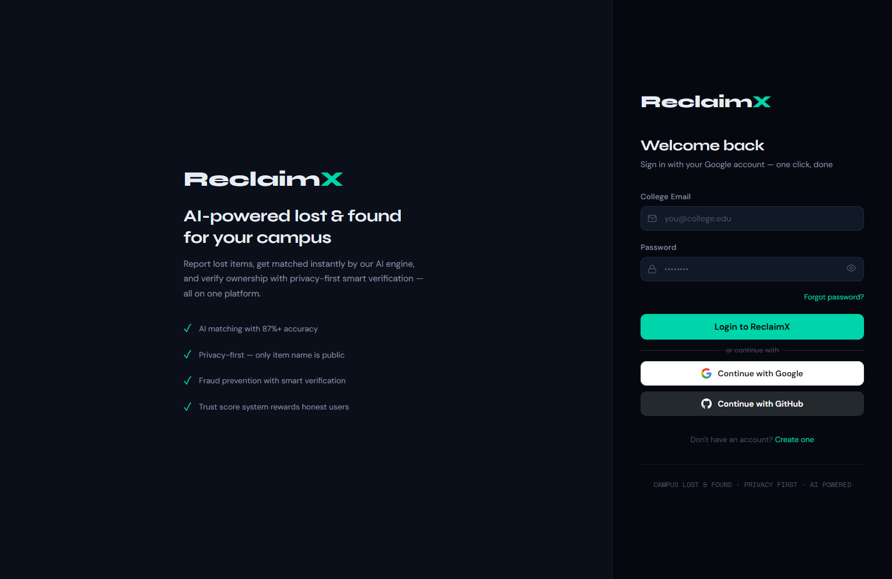
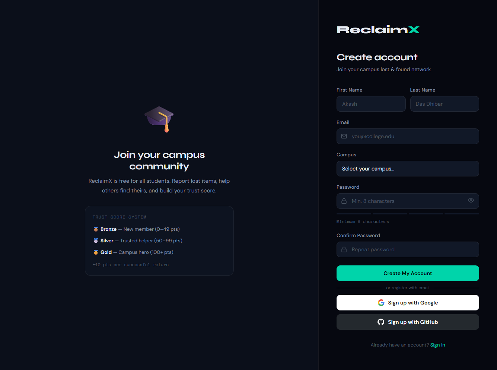
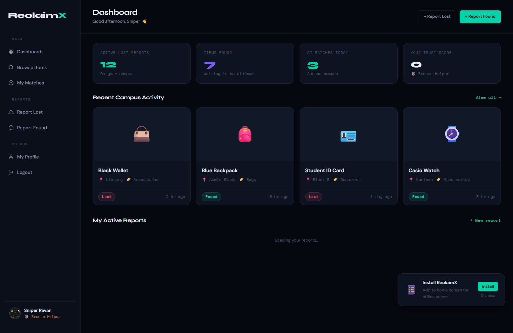
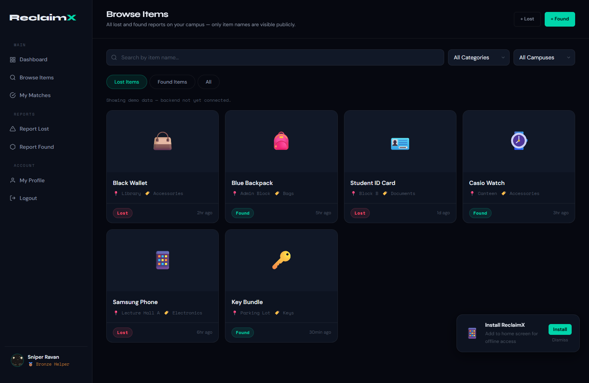
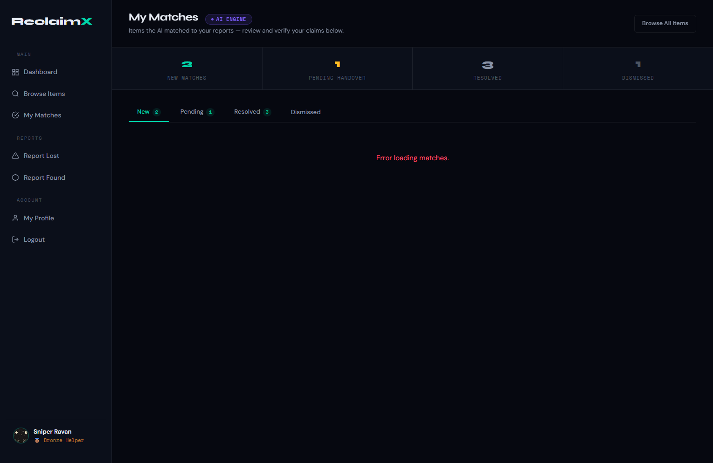
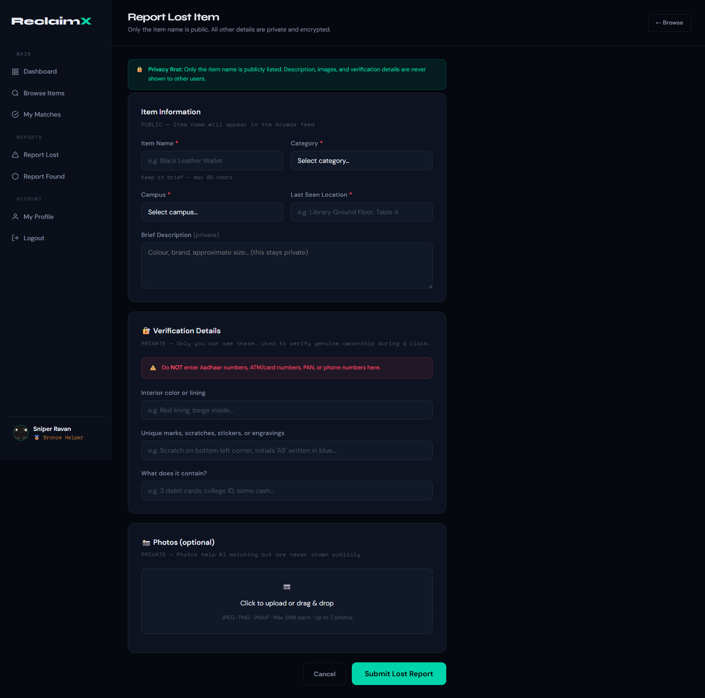
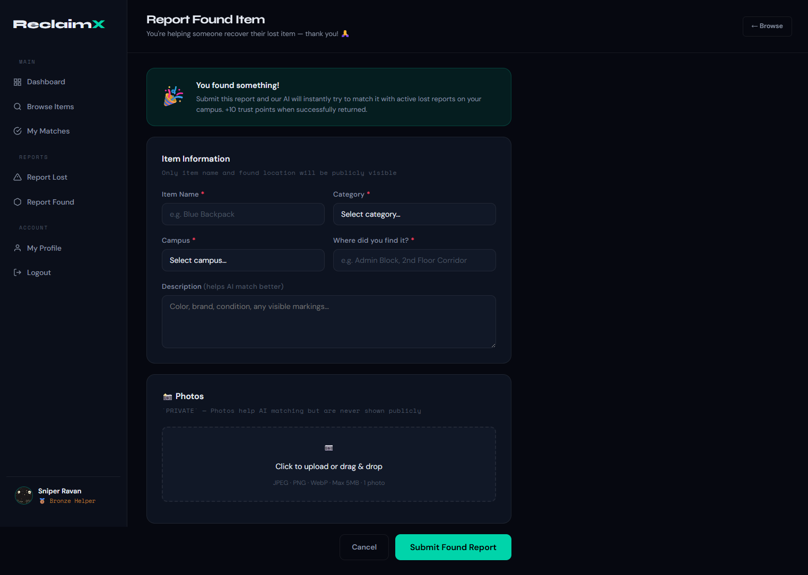
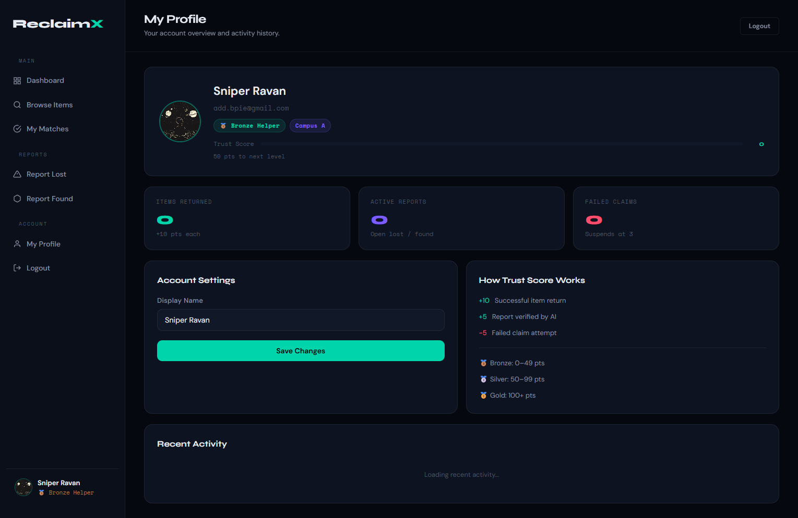

# ReclaimX — AI-Powered Campus Lost & Found

<p align="center">
  
  
  
  
  
  
</p>

> **Final Year Project**  
> Built by a 3-members team :- [Sniper Ravan](https://github.com/SniperRavan)

<p align="center">
  <strong>Smart. Secure. Automated.</strong><br/>
  AI-powered platform to recover lost items with intelligent matching & fraud-proof verification.
</p>

---

## What is ReclaimX?

ReclaimX is a full-stack web platform that replaces the traditional "lost & found notice board" with an intelligent, privacy-first system. When a student loses something on campus, they report it. When someone finds something, they report it. A custom **hybrid AI engine** then matches them — automatically, in real time.

Key design goals:
- **Privacy first** — only the item name is ever publicly visible. Descriptions, photos, and verification details are private.
- **Fraud prevention** — ownership is verified via 3 secret questions only the real owner could answer. 3 failed attempts = account suspended.
- **Trust system** — users earn Bronze → Silver → Gold status for successful returns.
- **Works offline** — full PWA with service worker caching.

---

## Screenshots

| Home Page | Login Page | Signup Page |
|---|---|---|
|  |  |  |

| Dashboard | Browse Items |
|---|---|
|  |  |

| My Matches | Report Lost Item |
|---|---|
|  |  |

| Report Found Item | Profile |
|---|---|
|  |  |

> 📁 Screenshots are in `docs/screenshots/`. Drop new ones there if you update the UI.

---

## Tech Stack

| Layer | Technology |
|---|---|
| **Frontend** | Vanilla HTML5, CSS3, JavaScript (ES Modules) |
| **PWA** | Service Worker + Web App Manifest |
| **Authentication** | Firebase Auth (Email/Password, Google, GitHub) |
| **Backend** | Node.js + Express.js |
| **Database** | Supabase (PostgreSQL) |
| **Image Storage** | Cloudinary |
| **AI Matching** | Custom hybrid engine (TF-IDF + location + time decay + image score) |
| **Security** | Helmet.js, express-rate-limit, Firebase ID token verification |

---

## How the AI Matching Works

When a lost or found item is submitted, the engine immediately runs against all open matching items on the same campus:

```
Final Score = (Text Score × 40%) + (Image Score × 30%) + (Location Score × 20%) + (Time Score × 10%)
```

| Signal | Method |
|---|---|
| **Text** | TF-IDF style Jaccard similarity on item name + description |
| **Image** | Placeholder (65 if both have images, else 40) — MobileNet embeddings planned |
| **Location** | Token overlap between last-seen and found locations |
| **Time decay** | Score decreases the further apart the report times are |

A match is created only if the final score ≥ **55%** and the campus + category both match.

---

## Ownership Verification (Anti-Fraud)

After an AI match is created, the claimer must answer **3 questions** generated from the private hidden attributes the reporter filled in:

- Interior colour / lining
- Unique marks, scratches, stickers, or engravings
- What the item contains

The answers are checked server-side. Score ≥ 60% → claim verified. Below that → failed attempt logged. **3 strikes → account suspended.**

---

## Trust Score System

| Level | Points Required | Perks |
|---|---|---|
| 🥉 Bronze Helper | 0 – 49 pts | Default |
| 🥈 Silver Helper | 50 – 99 pts | Mid-tier trust |
| 🥇 Gold Hero | 100+ pts | Priority claim processing |

+10 points per successful item return.

---

## Project Structure

```
RECLAIMX/
├── index.html                  ← Public landing page
├── manifest.json               ← PWA manifest
├── service-worker.js           ← Offline caching
├── package.json
│
├── pages/
│   ├── login.html              ← Firebase auth (email, Google, GitHub)
│   ├── register.html           ← New account creation
│   ├── dashboard.html          ← Campus feed + stats + my reports
│   ├── browse.html             ← Public browse with search/filter
│   ├── report-lost.html        ← Report a lost item (with hidden attributes)
│   ├── report-found.html       ← Report a found item
│   ├── matches.html            ← AI match results + verification flow
│   ├── profile.html            ← Profile, trust score, activity history
│   └── 404.html
│
├── assets/
│   ├── css/global.css          ← Full design system (dark theme, tokens)
│   ├── js/
│   │   ├── main.js             ← API base, toast system, utilities
│   │   ├── auth.js             ← Session guard, token refresh helper
│   │   ├── firebase-config.js  ← Loads Firebase config from backend
│   │   └── pwa.js              ← Service worker registration
│   └── icons/                  ← Favicon + PWA icons
│
├── components/
│   ├── sidebar.html            ← Shared app sidebar (injected per page)
│   └── toast.html              ← Toast notification container
│
└── backend/
    ├── server.js               ← Express app entry point
    ├── .env                    ← Secrets (never commit this)
    ├── config/
    │   ├── firebase.js         ← Firebase Admin SDK setup
    │   ├── supabase.js         ← Supabase client (service role)
    │   ├── cloudinary.js       ← Cloudinary + multer upload config
    │   └── serviceAccountKey.json  ← Firebase Admin key (never commit)
    ├── middleware/
    │   └── authMiddleware.js   ← Verifies Firebase ID token on every protected route
    ├── routes/
    │   ├── authRoutes.js       ← /api/auth/*
    │   ├── itemRoutes.js       ← /api/items/*
    │   ├── matchRoutes.js      ← /api/matches/*
    │   └── configRoutes.js     ← /api/config/firebase (sends config to frontend)
    ├── ai/
    │   └── matchingEngine.js   ← Hybrid AI scoring + auto-claim creation
    └── utils/
        ├── sensitiveDataFilter.js  ← Blocks Aadhaar, PAN, card numbers in descriptions
        └── verificationEngine.js   ← Scores ownership verification answers
```

---

## Database Schema (Supabase / PostgreSQL)

```sql
-- Users
CREATE TABLE users (
  id UUID DEFAULT gen_random_uuid() PRIMARY KEY,
  firebase_uid TEXT UNIQUE NOT NULL,
  name TEXT NOT NULL,
  email TEXT UNIQUE NOT NULL,
  campus_id TEXT DEFAULT 'campus_a',
  photo TEXT DEFAULT '',
  trust_score INTEGER DEFAULT 0,
  trust_level TEXT DEFAULT 'Bronze',
  failed_claims INTEGER DEFAULT 0,
  is_suspended BOOLEAN DEFAULT false,
  created_at TIMESTAMPTZ DEFAULT NOW()
);

-- Lost items (hidden attributes stored privately for verification)
CREATE TABLE lost_items (
  id UUID DEFAULT gen_random_uuid() PRIMARY KEY,
  user_id UUID REFERENCES users(id),
  campus_id TEXT NOT NULL,
  item_name TEXT NOT NULL,       -- PUBLIC
  description TEXT,              -- PRIVATE
  category TEXT,
  last_seen_location TEXT,       -- PUBLIC
  image_urls TEXT[] DEFAULT '{}',-- PRIVATE
  hidden_color_inside TEXT,      -- PRIVATE (verification)
  hidden_unique_marks TEXT,      -- PRIVATE (verification)
  hidden_contains TEXT,          -- PRIVATE (verification)
  status TEXT DEFAULT 'Lost',    -- Lost | Pending | Resolved
  created_at TIMESTAMPTZ DEFAULT NOW()
);

-- Found items
CREATE TABLE found_items (
  id UUID DEFAULT gen_random_uuid() PRIMARY KEY,
  user_id UUID REFERENCES users(id),
  campus_id TEXT NOT NULL,
  item_name TEXT NOT NULL,       -- PUBLIC
  description TEXT,              -- PRIVATE
  category TEXT,
  found_location TEXT,           -- PUBLIC
  image_url TEXT DEFAULT '',     -- PRIVATE
  status TEXT DEFAULT 'Found',   -- Found | Resolved
  created_at TIMESTAMPTZ DEFAULT NOW()
);

-- Claims (AI-generated matches + verification state)
CREATE TABLE claims (
  id UUID DEFAULT gen_random_uuid() PRIMARY KEY,
  lost_item_id UUID REFERENCES lost_items(id),
  found_item_id UUID REFERENCES found_items(id),
  claimant_id UUID REFERENCES users(id),
  match_score FLOAT DEFAULT 0,
  answer_1 TEXT, answer_2 TEXT, answer_3 TEXT,
  verification_score FLOAT DEFAULT 0,
  loster_confirmed BOOLEAN DEFAULT false,
  founder_confirmed BOOLEAN DEFAULT false,
  status TEXT DEFAULT 'Pending', -- Pending | Verified | Rejected | Resolved
  created_at TIMESTAMPTZ DEFAULT NOW()
);
```

> ⚠️ **Important:** After creating tables in Supabase, your backend **must** use the `service_role` (secret) key — not the `anon` (public) key — otherwise Row Level Security will block all inserts.

---

## API Reference

### Auth — `/api/auth`

| Method | Endpoint | Auth | Description |
|--------|----------|------|-------------|
| `POST` | `/session` | No | Verify Firebase token + upsert user in DB |
| `GET` | `/me` | ✅ | Get current user's full profile |
| `PUT` | `/profile` | ✅ | Update display name |
| `POST` | `/avatar` | ✅ | Upload profile photo to Cloudinary |
| `POST` | `/forgot-password` | No | Send Firebase password reset email |

### Items — `/api/items`

| Method | Endpoint | Auth | Description |
|--------|----------|------|-------------|
| `GET` | `/` | No | Browse all open lost & found items (paginated, filterable) |
| `GET` | `/me` | ✅ | Get current user's own reports |
| `POST` | `/lost` | ✅ | Report a lost item (triggers AI matching) |
| `POST` | `/found` | ✅ | Report a found item (triggers AI matching) |

### Matches — `/api/matches`

| Method | Endpoint | Auth | Description |
|--------|----------|------|-------------|
| `GET` | `/` | ✅ | Get all claims for current user |
| `POST` | `/verify` | ✅ | Submit ownership verification answers |
| `POST` | `/confirm-handover/:claimId` | ✅ | Confirm physical item handover |
| `POST` | `/dismiss/:claimId` | ✅ | Dismiss / delete a match |

### Config & Health

| Method | Endpoint | Auth | Description |
|--------|----------|------|-------------|
| `GET` | `/api/config/firebase` | No | Returns Firebase client config (avoids hardcoding in HTML) |
| `GET` | `/api/health` | No | Server health check |

---

## Local Setup

### Prerequisites
- Node.js ≥ 18
- A [Firebase](https://firebase.google.com) project with Email/Password + Google + GitHub auth enabled
- A [Supabase](https://supabase.com) project with the schema above applied
- A [Cloudinary](https://cloudinary.com) account

### 1. Clone & install
```bash
git clone https://github.com/SniperRavan/RECLAIMX.git
cd reclaimx
npm install
```

### 2. Configure environment
```bash
# Copy the example and fill in your values
cp backend/.env.example backend/.env
```

Your `backend/.env` needs:
```env
PORT=5000

# Supabase — use the SECRET (service_role) key, NOT the anon key
SUPABASE_URL=https://your-project.supabase.co
SUPABASE_KEY=your_service_role_key_here

# Firebase Admin SDK
FIREBASE_API_KEY=...
FIREBASE_AUTH_DOMAIN=...
FIREBASE_PROJECT_ID=...
FIREBASE_STORAGE_BUCKET=...
FIREBASE_MESSAGING_SENDER_ID=...
FIREBASE_APP_ID=...

# Cloudinary
CLOUDINARY_CLOUD_NAME=...
CLOUDINARY_API_KEY=...
CLOUDINARY_API_SECRET=...

# CORS — frontend URL
CLIENT_URL=http://localhost:3000
```

### 3. Firebase Admin SDK key
1. Firebase Console → Project Settings → Service Accounts
2. Click **Generate New Private Key** → download JSON
3. Rename to `serviceAccountKey.json` → place in `backend/config/`

> ⚠️ `serviceAccountKey.json` is gitignored. **Never commit it.**

### 4. Apply Supabase schema
Paste the SQL from the **Database Schema** section above into your Supabase SQL Editor and run it.

### 5. Run locally
```bash
# Terminal 1 — Backend API (port 5000)
npm run dev

# Terminal 2 — Frontend static server (port 3000)
npm run serve
```

Open **http://localhost:3000**

---

## npm Scripts

| Script | Command | What it does |
|--------|---------|-------------|
| `npm start` | `node backend/server.js` | Production backend |
| `npm run dev` | `nodemon backend/server.js` | Dev backend with auto-restart |
| `npm run serve` | `npx serve . -l 3000` | Serve frontend on port 3000 |
| `npm run dev:all` | Both in separate windows | Start everything at once (Windows) |

---

## Security Notes

- All API keys live in `backend/.env` — never in frontend HTML
- Firebase config is served from `/api/config/firebase` endpoint (safe — it's public config, not secret)
- Sensitive data filter blocks Aadhaar, PAN, ATM card numbers, and phone numbers in item descriptions
- Helmet.js sets security headers on all responses
- Rate limiting: 100 requests per 15 minutes per IP
- Firebase token is verified server-side on every protected request
- Supabase service role key is backend-only; the frontend never sees it

---

## Known Limitations / Planned Improvements

- [ ] Image-based AI matching (MobileNet embeddings) — currently uses a static placeholder score
- [ ] Email notifications when a match is found
- [ ] Admin dashboard for campus coordinators
- [ ] Full RLS policy setup (currently bypassed via service role key)
- [ ] Mobile app (React Native / Flutter)
- [ ] GitHub OAuth may need additional Firebase console setup per deployment

---

## Team

| Role | Name | GitHub |
|------|------|--------|
| Leader | Member 0 | _Add GitHub_ |
| Team Member | Sniper Ravan | [@SniperRavan](https://github.com/SniperRavan) |
| Team Member | Member 2 | _Add GitHub_ |

**Institution:** Private Institute  
**Project Type:** Final Year, Last Semester Project

---

## License

This project is submitted as an academic project for my college. All rights reserved by the authors. Not licensed for commercial use without permission.

---

<p align="center">
  
</p>


<div align="center">
  <strong>ReclaimX</strong> — Because losing things on campus shouldn't mean losing them forever.<br/>
  Built with ❤️
</div>
